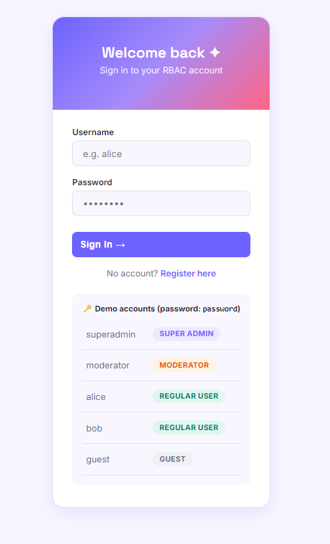
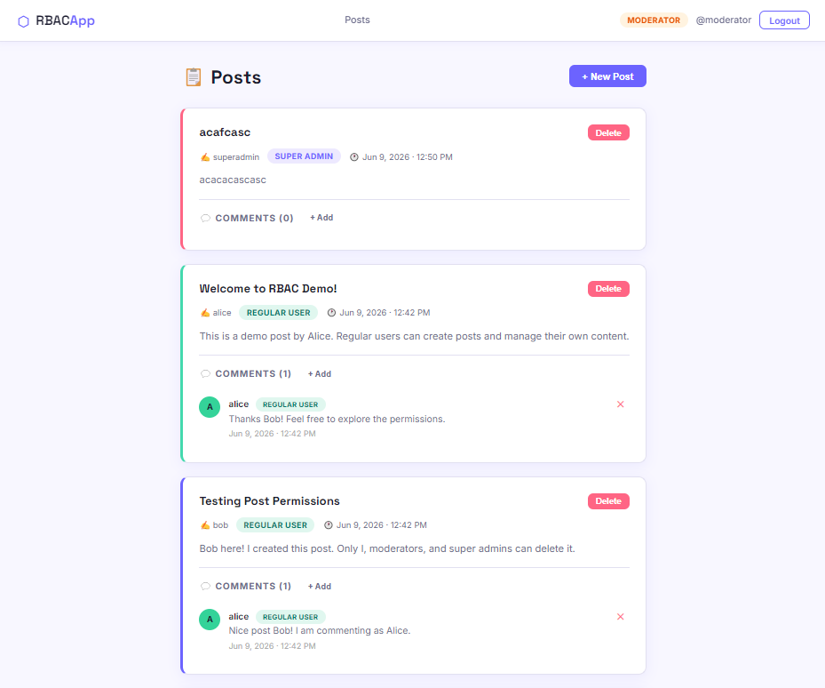
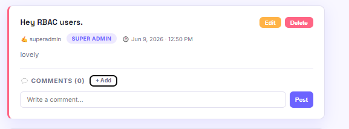
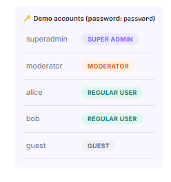

<div align="center">

# ⬡ RBAC App
### Role-Based Access Control System

<br/>


<br/>

> A full-stack **Role-Based Access Control** web application built with **PHP**, **MySQL**, **HTML/CSS**, and **Vanilla JavaScript** — featuring 4 distinct user roles, session-based authentication, and a real-time commenting system with fine-grained permission enforcement.

<br/>


</div>

---

## 📋 Table of Contents

- [Overview](#-overview)
- [Live Screenshots](#-live-screenshots)
- [Features](#-features)
- [Role & Permission Matrix](#-role--permission-matrix)
- [Tech Stack](#-tech-stack)
- [Project Structure](#-project-structure)
- [Getting Started](#-getting-started)
- [Database Schema](#-database-schema)
- [Demo Accounts](#-demo-accounts)
- [Author](#-author)

---

## 🔍 Overview

This project demonstrates a complete **Role-Based Access Control (RBAC)** system where different users have different levels of access to resources. Built as a Full Stack Developer hiring assessment, it showcases:

- Secure **session-based authentication** with bcrypt password hashing
- A **4-tier role hierarchy** enforced on both frontend and backend
- **Real-time AJAX** interactions — comments add and delete without page reload
- A centralized **permission layer** (`auth.php`) that governs every action
- A **colorful, modern UI** built entirely with vanilla CSS — zero frameworks

---

## 📸 Live Screenshots

### 🔐 Login Page
> Secure session-based login with demo account reference panel



---

### 📋 Posts Feed
> Main dashboard — create, edit, and delete posts based on your role



---

### 💬 Comments System
> Real-time AJAX commenting with fine-grained per-role delete permissions



---

### 👥 User Management
> Super Admin exclusive panel — change roles or remove users entirely



---

## ✨ Features

- 🔐 **Authentication** — Register, login, logout with `password_hash` / `password_verify` (bcrypt)
- 👥 **4 User Roles** — Super Admin, Moderator, Regular User, Guest
- 📝 **Posts** — Create, edit, delete with strict ownership enforcement
- 💬 **Comments** — Add and delete with fine-grained permission logic
- ⚡ **AJAX Comments** — Live add/delete without any page refresh
- 🛡️ **User Management** — Super Admin can promote, demote, or delete any user
- 🔔 **Toast Notifications** — Real-time feedback on every action
- ✅ **Confirm Modals** — Safe delete flow with confirmation dialogs
- 🎨 **Modern UI** — Gradient accents, role-colored badges, responsive layout
- 📱 **Responsive** — Works cleanly on desktop and mobile

---

## 🔐 Role & Permission Matrix

| Action | Super Admin | Moderator | Regular User | Guest |
|---|:---:|:---:|:---:|:---:|
| View posts & comments | ✅ | ✅ | ✅ | ✅ |
| Create a post | ✅ | ✅ | ✅ | ❌ |
| Edit own post | ✅ | ❌ | ✅ | ❌ |
| Delete **any** post | ✅ | ✅ | ❌ | ❌ |
| Delete **own** post | ✅ | ✅ | ✅ | ❌ |
| Create a comment | ✅ | ✅ | ✅ | ❌ |
| Delete **own** comment | ✅ | ✅ | ✅ | ❌ |
| Delete comment on **own post** | ✅ | ✅ | ✅ | ❌ |
| Delete **any** comment | ✅ | ✅ | ❌ | ❌ |
| Manage users (roles / delete) | ✅ | ❌ | ❌ | ❌ |

### 💬 Comment Permission Logic

```
Scenario: User A creates a post → User B comments on it

  ✅ User A  (post owner)     → can delete User B's comment
  ✅ User B  (comment author) → can delete their own comment
  ❌ User C  (any other user) → cannot delete User B's comment
  ✅ Moderator                → can delete any comment
  ✅ Super Admin              → can delete absolutely anything
```

---

## 🛠 Tech Stack

| Layer | Technology |
|---|---|
| **Backend** | PHP 8.x — plain, no framework |
| **Database** | MySQL 8 via PDO (prepared statements) |
| **Frontend** | HTML5, CSS3, Vanilla JavaScript (ES6+) |
| **Authentication** | PHP Sessions + `password_hash` (bcrypt) |
| **AJAX** | Fetch API → JSON endpoints |
| **Server** | Apache via XAMPP |
| **Fonts** | Google Fonts — Inter, Space Grotesk |

---

## 📁 Project Structure

```
rbac_project/
│
├── index.php                   # Root redirect to posts feed
├── database.sql                # Full DB schema + demo seed data
├── .gitignore
├── README.md
│
├── includes/                   # Shared core modules
│   ├── db.php                  # PDO singleton connection
│   ├── auth.php                # Session helpers + all permission functions
│   ├── header.php              # Global navbar HTML
│   └── footer.php              # Global footer + JS include
│
├── pages/                      # User-facing pages
│   ├── login.php               # Login form + session creation
│   ├── register.php            # Registration (assigns Regular User role)
│   ├── logout.php              # Session destroy + redirect
│   ├── posts.php               # Main feed — posts + comments
│   ├── edit_post.php           # Edit post (owner or Super Admin only)
│   └── users.php               # User management (Super Admin only)
│
├── api/                        # AJAX JSON endpoints
│   ├── create_post.php         # POST → insert new post
│   ├── delete_post.php         # POST → delete post (permission checked)
│   ├── add_comment.php         # POST → insert comment, returns JSON
│   └── delete_comment.php      # POST → delete comment (permission checked)
│
└── assets/
    ├── css/
    │   └── style.css           # Full custom design system (no frameworks)
    ├── js/
    │   └── main.js             # AJAX helpers, toast, confirm modal
    └── demo/                   # Screenshots used in this README
        ├── Interface.png
        ├── login.png
        ├── Post.png
        ├── comments.png
        └── user.png
```

---

## 🚀 Getting Started

### Prerequisites

- [XAMPP](https://www.apachefriends.org/) — Apache + MySQL + PHP 8.x
- [VS Code](https://code.visualstudio.com/)
- [Git](https://git-scm.com/)

### Installation

**1. Clone the repository**

```bash
git clone https://github.com/YOUR_USERNAME/rbac_project.git
```

**2. Move to XAMPP's web root**

```
C:\xampp\htdocs\rbac_project\
```

**3. Start XAMPP services**

Open **XAMPP Control Panel** → Start **Apache** and **MySQL**

**4. Import the database**

- Open `http://localhost/phpmyadmin`
- Create a new database named `rbac_project`
- Click **Import** → select `database.sql` → click **Go**

**5. Configure database credentials** *(only if your MySQL has a password)*

Open `includes/db.php`:

```php
define('DB_HOST', 'localhost');
define('DB_USER', 'root');
define('DB_PASS', '');        // ← add your MySQL password here if set
define('DB_NAME', 'rbac_project');
```

**6. Open the app**

```
http://localhost/rbac_project
```

---

## 🗄️ Database Schema

```sql
roles      → id, name, label
users      → id, username, email, password (bcrypt), role_id, created_at
posts      → id, user_id, title, content, created_at, updated_at
comments   → id, post_id, user_id, content, created_at
```

**Relationships:**
- `users.role_id` → `roles.id`
- `posts.user_id` → `users.id` *(CASCADE DELETE)*
- `comments.post_id` → `posts.id` *(CASCADE DELETE)*
- `comments.user_id` → `users.id` *(CASCADE DELETE)*

---

## 🔑 Demo Accounts

All demo accounts share the password: **`password`**

| Username | Role | What they can do |
|---|---|---|
| `superadmin` | ⬡ Super Admin | Full access — delete anything, manage all users and roles |
| `moderator` | 🛡️ Moderator | Delete any post or comment — cannot manage users |
| `alice` | 👤 Regular User | Create posts & comments, manage only her own content |
| `bob` | 👤 Regular User | Same as Alice — useful for testing cross-user comment permissions |
| `guest` | 👁️ Guest | View-only — cannot post, comment, or delete anything |

---

## 👤 Author

**Tansiv Jubayer**

[](https://github.com/Tansiv)
[](https://www.linkedin.com/in/tansiv-jubayer/)
[](mailto:jtansiv@gmail.com)

---

<div align="center">

Built with 💜 as a Full Stack Developer assessment — demonstrating RBAC architecture, session auth, and AJAX-driven UI in plain PHP + MySQL.

⭐ Found this useful? Give it a star!

</div>